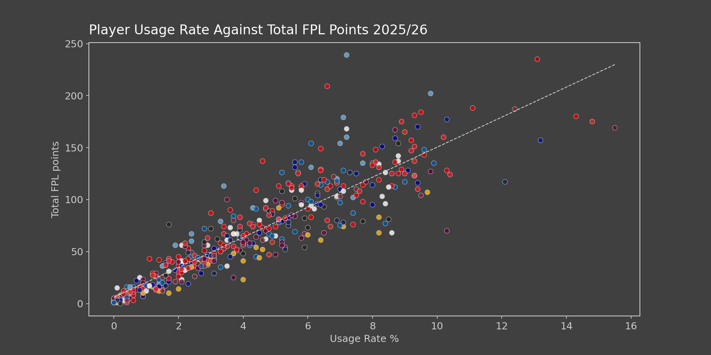

# Premier League Usage Rates
DATA ANALYSIS · FOOTBALL ANALYTICS

An investigation into wether the concept of Usage Rates in basketball
can be adapted to football and to its potential applications within football analytics.

## Overview
The aim of this project was to define a player's Usage Rate in a similar way to basketball and compare it with their Attacking Involvement.

Using data from the 2025/26 Premier League season, I compared players across different positional groups and within individual teams.

The objective was to investigate whether Usage Rate can provide insight into creative involvement, player roles within their teams and potential transfer fit.

## Methodology
- Defined Possession Ending Actions (PEA) as all actions in a football match that can result in a player ending their team's possession.
- Defined Usage Rate as a player's total PEA across the season as a proportion of their team's total PEA.
- Defined Shot Creating Actions (SCA) as the metric to evaluate a player's creativity.
- Defined Attacking Involvement as a players total SCA across the season as a proportion of their team's total SCA.
- Defined Relative Creative Efficiency (RCE) within a team as a player's Attacking Involvement divided by their Usage Rate.

## Key Findings
- Midfielders showed the strongest relationship between PEA / 90 and SCA / 90 of all positional groups, with an R²= 0.407.
- Positional analysis identified players whose creative output was unusually high or low relative to their level of ball involvement, although tactical context was essential when interpreting these results.
- Team Usage Rate analysis provided additional insight into player roles and how potential transfers might fit within a team's existing attacking structure.
- Usage Rate showed a strong relationship with total FPL points, with an R² of 0.827, highlighting its potential application in Fantasy Premier League analysis.
- 
## Project Structure

```text
data/
├── raw/
├── cleaned/
│   ├── player_data_cleaned.csv
│   ├── team_data_cleaned.csv
│   └── SCA.csv
├── player_data_master.csv
└── player_usage_data.csv

figures/
├── html/
│   ├── positions/
│   ├── teams/
│   └── team-transfers/
├── positions/
└── teams/

notebooks/
└── usage_rates_analysis.ipynb

src/
├── scraping.py
├── cleaning.py
├── sca.py
├── metrics.py
└── plotting.py

README.md
requirements.txt
```

## Data
The majority of the data used in this project was collected from SofaScore. SCA was derived from WhoScored event data from the 2025/26 season using a custom algorithm to identify the two offensive actions preceding each shot.

Miscontrols were not included in the PEA calculation due to the lack of a sufficiently complete and reliable data source.

The raw scraped datasets are not included in the repository due to their size.

## Technologies
- Python
- SoccerData
- ScraperFC
- Pandas
- NumPy
- SciPy
- scikit-learn
- Matplotlib
- Plotly
- Jupyter

## Results

### Positional Analysis


### Team Analysis


### FPL


## Limitations
- Incomplete data meant that PEA and SCA were estimates rather than definitive measures.
- Usage Rate was influenced by playing time because it was calculated from total season PEA rather than being normalised for minutes played.
- The relationship between PEA and SCA often required additional tactical context to understand the roles players performed within their teams.

## Future Improvements
- Strengthen the underlying data by incorporating complete and reliable data for miscontrols and official SCA.
- Expand the transfer analysis to include data from a wider range of leagues.
- Improve the Usage Rate calculation by accounting for the time a player spends on the pitch and comparing their involvement with their teammates during those periods.

For the full analysis, check out my [football analytics website](https://football-analytics-portfolio.vercel.app/)